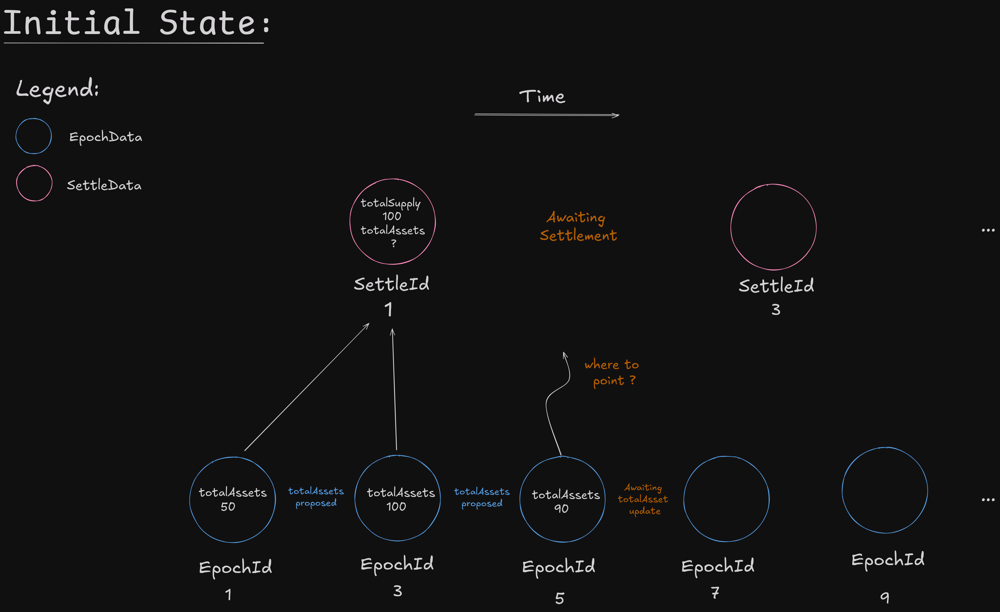
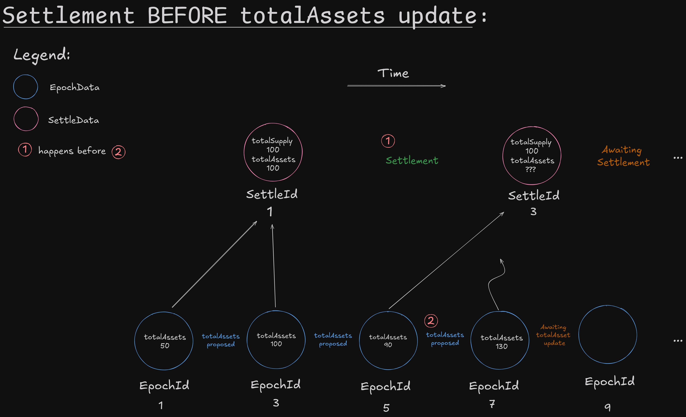
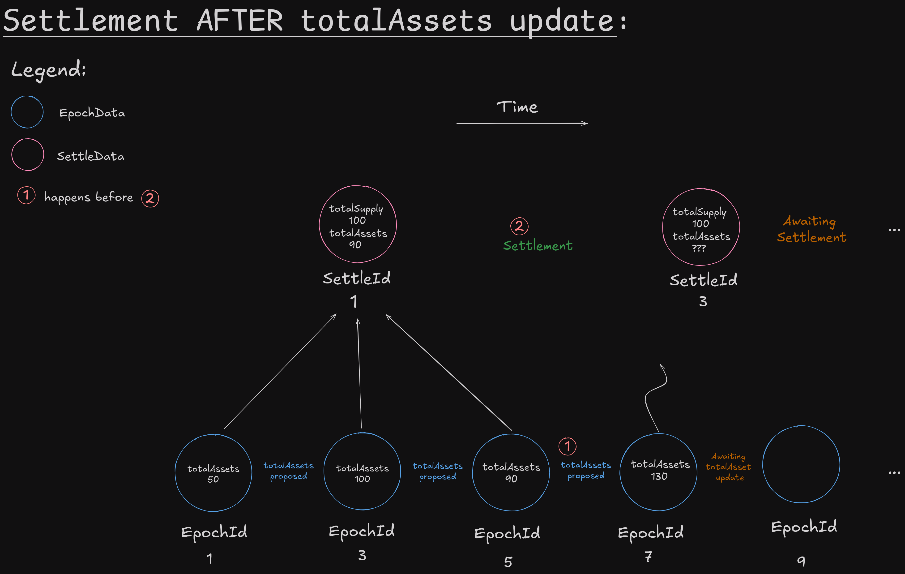

# Key Data Structures and Epoch mechanism

## EpochData

```solidity
/// @dev Holds data for a specific epoch.
/// @param settleId Unique identifier for the related settlement data.
/// @param depositRequest Records deposit requests by address.
/// @param redeemRequest Records redeem requests by address.
struct EpochData {
    uint40 settleId;
    mapping(address => uint256) depositRequest;
    mapping(address => uint256) redeemRequest;
}
```

## SettleData

```solidity
/// @dev Holds settlement data for the vault.
/// @param totalSupply Total number of shares for this settlement.
/// @param totalAssets Total value of assets managed by the vault for this settlement.
struct SettleData {
    uint256 totalSupply;
    uint256 totalAssets;
}
```


```solidity
mapping(uint40 epochId => EpochData) epochs;
mapping(uint40 settleId => SettleData) settles;
```

## Guide to Epoch Data and Settlement in Vaults

How **EpochData** and **SettleData** are managed within a vault, particularly during the valuation and total asset update processes.

### **Overview of Epoch Data and Settle Data**

Each **Epoch Data** corresponds to a proposed **total assets** update, which is made by the **valuation manager**. Every time a new valuation is proposed for the vault, a new **Epoch Data** is created. This data holds details about all users' deposits and redemption requests and includes a reference to **Settle Data**.

The S**ettle Data** is updated by the **asset manager** of the vault, who is responsible for finalizing the total assets of the vault after the valuation process.

**Example: Understanding Epochs and Settlement**

To clarify how this process works, let's examine the following scenario:

* We have **two Epoch Data instances**: Epoch 1 and Epoch 3.
* Both are pointing to **Settle Data 1**, which is not yet finalized (or "settled"). Therefore, the total assets in **Settle Data 1** are still undefined and await confirmation from the asset manager.
* The **current epoch** is Epoch 5, which has not yet been associated with any settle data. This is the epoch where users are actively depositing.

<figure><figcaption></figcaption></figure>

### **Where should Epoch Data 5 point?**

The challenge is determining when and to which settle data the current Epoch Data (Epoch 5) should point. The decision hinges on the next settlement event or total assets update. There are two potential scenarios:

<figure><figcaption></figcaption></figure>

### Scenario 1: Settlement Occurs Before a New Total Assets Update

In this scenario, the vault is settled before a new total assets valuation is proposed.

* Once the settlement is completed, Epoch 5 can point to **Settle Data 3** (instead of Settle Data 1), ensuring fairness.
* This is crucial because we don't want users depositing in Epoch 5 to benefit from the same valuation as those in Epoch 1 and Epoch 3, who are already aware of the valuation they will be settled at.
* After the settlement, **Settle Data 1** is finalized at the last proposed valuation, which, for this example, was **100 assets for 100 shares**.

***

<figure><figcaption></figcaption></figure>


### Scenario 2: Settlement Occurs After a New Total Assets Update

In this alternative scenario, a new valuation is proposed before the vault is settled.

* In this case, Epoch 5 can point to **Settle Data 1**, just as the previous epochs (Epoch 1 and Epoch 3) did.
* Afterward, the asset manager proceeds to settle the vault, enforcing the newly proposed valuation. For this example, the valuation is set at **90 assets for 100 shares**.

