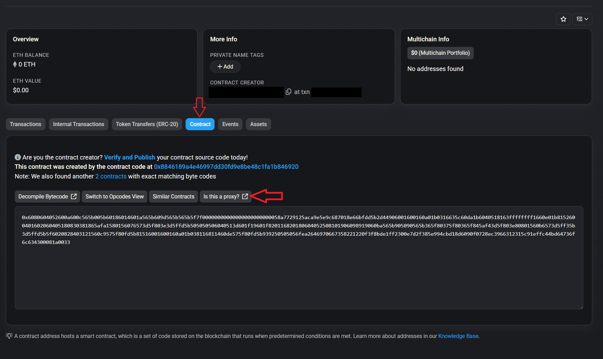
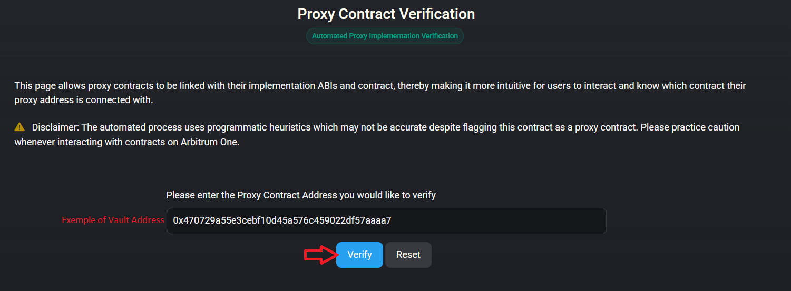
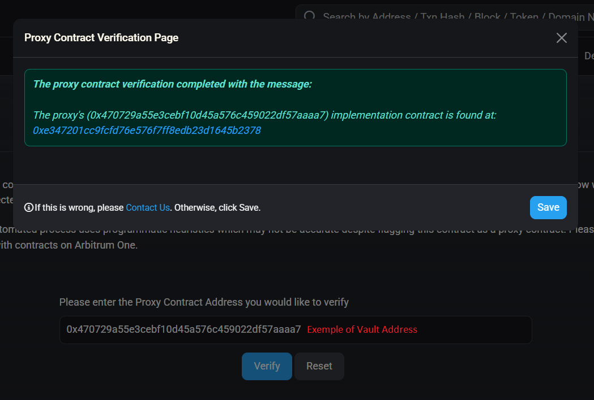
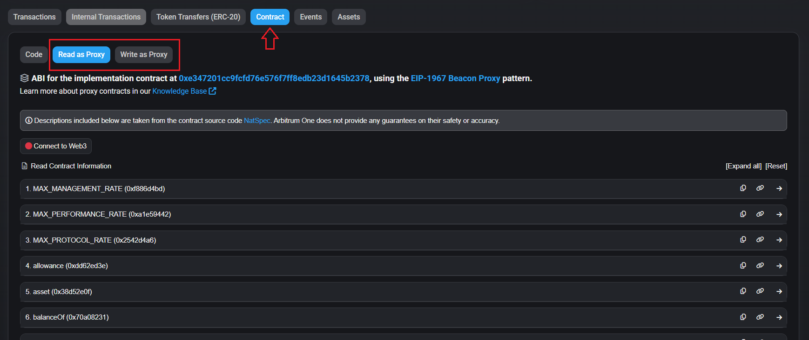

# Vault post-deployment operations

## Underlying asset approval

To enable user withdrawals, the custodial wallet (`safe` parameter) must infinite approve the vault address to spend `underlying`. For example, if the underlying is USDC, then as the safe you should approve the Vault to spend your USDC.

Call the following function on the underlying asset contract:

```solidity
approve(address spender, uint256 value)
```

* **`spender (address)`:**\
  The deployed **vault address**. This is the address that will be allowed to move the tokens from the curation address.
*   **`value (uint256)`:**\
    The approval amount. To avoid repeated approvals, you can do an infinite allowance. Use the following constant value:

    ```
    115792089237316195423570985008687907853269984665640564039457584007913129639935
    ```


Without this approval, the vault will not be able to process user withdrawals.


***

## Verify your vault on Etherscan

### Identify your vault as a proxy

Before interacting with your vault, you must confirm that it is a proxy contract.

#### Steps to verify the proxy

1. **Access Your Vault Contract**
   * Open your Vault’s contract page on the relevant block explorer (e.g., Etherscan, Arbiscan, etc..).
2. **Navigate to the Contract Tab**
   * Click on the **`Contract`** tab.
3.  **Click “Is this a proxy?”**

    * Scroll to the top right of section, click on the **“Is this a proxy?”** button and then on the "**Verify**" button.


    <figure><figcaption></figcaption></figure>

    <figure><figcaption></figcaption></figure>


    <figure><figcaption></figcaption></figure>
4. **Confirm Proxy Verification**
   * If verified, the explorer will display the interaction with the proxy logic.

<figure><figcaption></figcaption></figure>

Once your vault is confirmed as a proxy, you will be able to access the **Read** and **Write** functions of the deployed vault contract.
